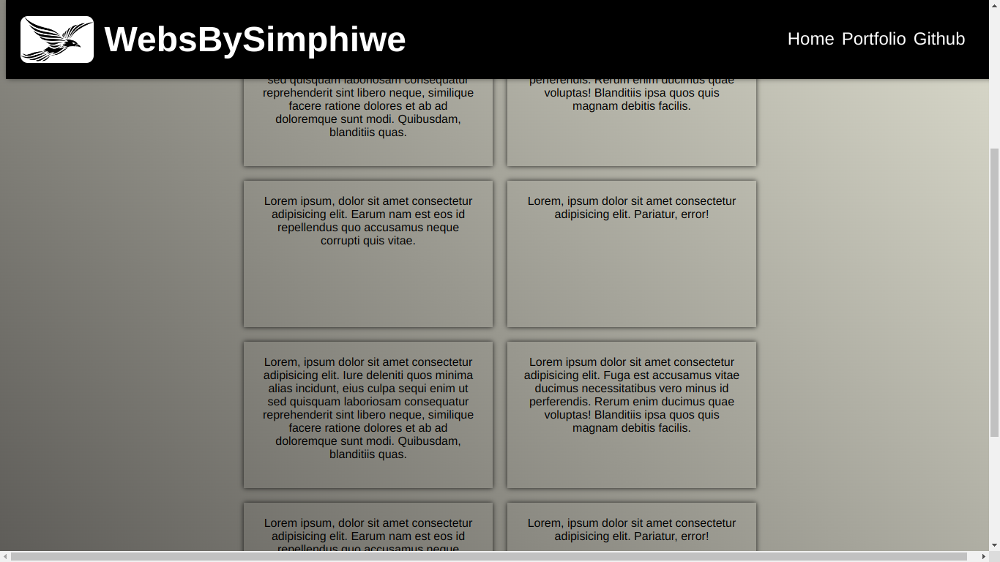

# Sticky Navbar

Check it _**LIVE**_ 👉
**<https://deebest.github.io/sticky-navbar/>**

A _**STICKY NAVBAR**_ that has a smooth background transition as you scroll down, responsive to any screen size.

## Uses

- Good for someone looking for a responsive navbar.

- Javascript dynamically changes the background as you scroll down.

## Tech Stack Used

- GIT
- HTML
- CSS
- JavaScript

## Get In Touch 👇

Email : **<simphiwedladla8@gmail.com>**

Linked: **<https://www.linkedin.com/in/dladla-simphiwe-89061a20a/>**

Github: **<https://github.com/DeeBest>**

Portfolio: **<https://deebest.github.io/personal-webpage/>**
